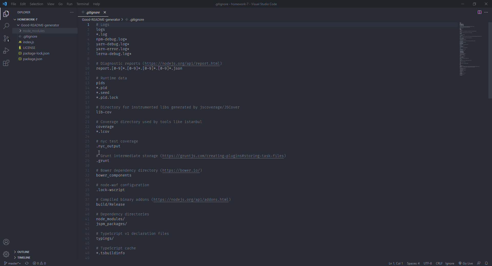

# GoodReadme-generator

 <br> [MIT](https://opensource.org/licenses/MIT)

1.[ Description. ](#desc)
<br>
2.[ Installation. ](#inst)
<br>
3.[ Usage. ](#use)
<br>
4.[ Contributing. ](#contr)
<br>
5.[ Testing. ](#test)
<br>
6.[ Github. ](#git)
<br>
7.[ Contact Me.](#conta)
<br>

<a id="desc"></a>
## 1.Description

This application allows user input to generate a readme to accompany the users application. It returns a readme file adding the inputs of the user into the sections provided. Technologies used for this application were node and javascript.

<a id="inst"></a>
## 2.Installation

Clone the repo run (npm init -y) then run (npm i inquirer) and then run (node index) all from the console.

<a id="use"></a>
## 3.Usage

This application is used to generate a read me. It can be used by whomever.

<a id="contr"></a>
## 4.Contributing

Open to contribution.

<a id="test"></a>
## 5.Testing
```
No instructions.
```
<a id="git"></a>
## 6.Github

[GitHub](https://github.com/veidul)

<a id="conta"></a>
## 7.Contact Me
Ludie Lambright
ludiefletcher@gmail.com


[Deployed Website]https://youtu.be/lakXWNqYOqc
